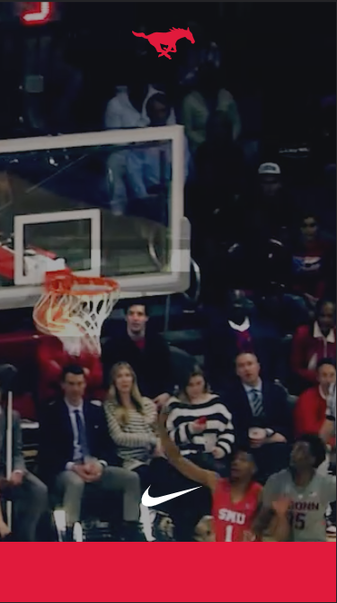
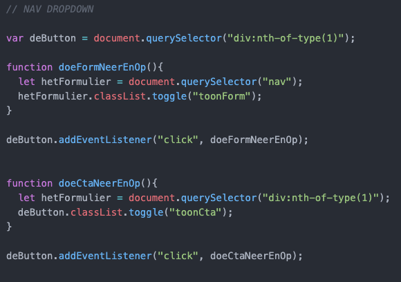
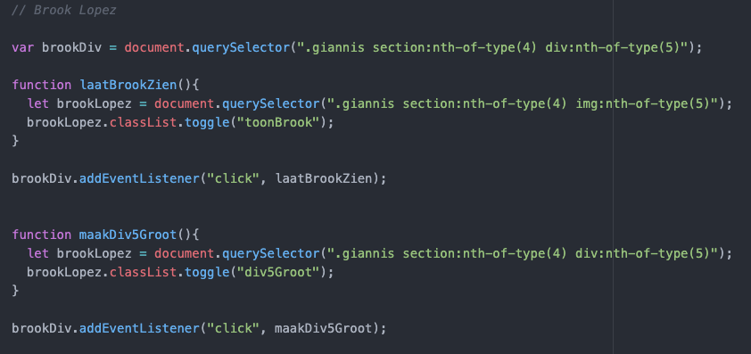
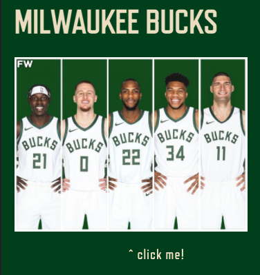
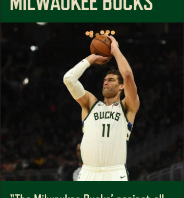
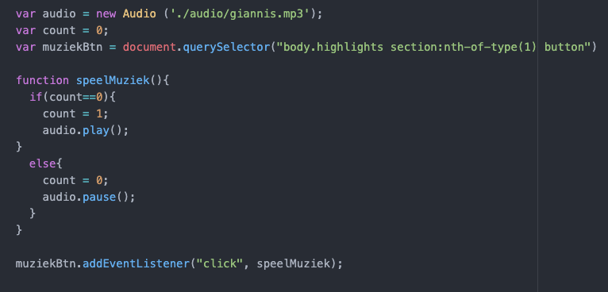
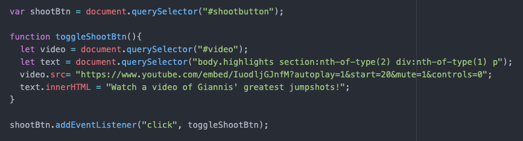
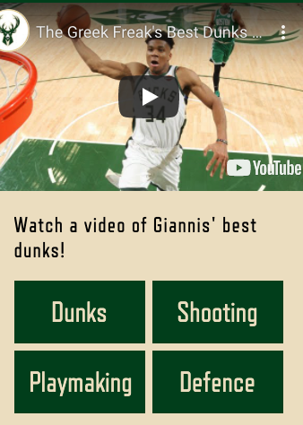

# Procesverslag
Markdown is een simpele manier om HTML te schrijven.  
Markdown cheat cheet: [Hulp bij het schrijven van Markdown](https://github.com/adam-p/markdown-here/wiki/Markdown-Cheatsheet).

Nb. De standaardstructuur en de spartaanse opmaak van de README.md zijn helemaal prima. Het gaat om de inhoud van je procesverslag. Besteedt de tijd voor pracht en praal aan je website.

Nb. Door *open* toe te voegen aan een *details* element kun je deze standaard open zetten. Fijn om dat steeds voor de relevante stuk(ken) te doen.

## Jij

uitwerken voor kick-off werkgroep

### Auteur:
Olivier Doornink (vervangen door jouw naam)

#### Je startniveau:
Blauw (kies uit zwart, rood óf blauw)

#### Je focus:
Surface plane (kies uit responsive óf surface plane)

## Je website

uitwerken voor kick-off werkgroep

### Je opdracht:
https://smubasketball.com/

#### Screenshot(s) van de eerste pagina (small screen):
SMU Basketball  

#### Screenshot(s) van de tweede pagina (small screen):
Mijn gekozen website is een one pager. Ik heb voor mijn 2e scherm zelf iets ontworpen in dezelfde stijl.

## Breakdownschets (week 1)

uitwerken na afloop 2e werkgroep

### de hele pagina:

### dynamisch deel (bijv menu):
Mijn voorbeeld website heeft geen menu. Verder zijn er alleen dynamische dingen zoals het tevoorschijn komen van tekst wanneer je er naartoe scrolt.

## Voortgang 1 (week 2)

uitwerken voor 1e voortgang

### Stand van zaken
Ik kon niet bij deze feedback sessie zijn. Ter vervanging heb ik een meeting met een studentassistent op dinsdag 14 december..

## Voortgang 2 (week 3)

uitwerken voor 2e voortgang

### Stand van zaken
Ik ben deze week begonnen met functies opstellen in javascript. Hierbij liep ik tegen een aantal problemen. Verder had ik weinig problemen deze week.

### Agenda voor meeting
Wij hebben nooit als groepje voorbereid wat we gingen vragen. Ieder stelde zijn of haar vragen en zo werd iedereen zijn probleem opgelost.

Ik heb gevraagd over de javascript die ik had geschreven voor mijn navigatie. Hier kwam ik niet uit maar met de hulp van de studentassistenten wel.

### Verslag van meeting
hier na afloop snel de uitkomsten van de meeting vastleggen

Ik heb mijn vastloop punten opgelost en kan weer verder werken.

## Toegankelijkheidstest (week 4)

uitwerken na test in 8e voortgang

### Bevindingen
Lijst met je bevindingen die in de test naar voren kwamen:

#### Menu dropdown icoon
 De navigatie is te bereiken met een enkele tab, hiervoor hoef je niet eerst de tab te openen. Wel kom je bij het icoon om de navigatie te openen als je met een screenreader de website navigeert. Dit kan verwarring veroorzaken.
 
 Er zijn twee oplossingen die ik hiervoor kan bedenken. De eerste is het icoon een naam geven waarbij iemand met een screenreader direct doorheeft dat dit icoon overgeslagen kan woorden. De tweede is de screenreader de image laten overslaan door middel van aria-hidden="true".

#### Screenreader slaat interactie over
Wanneer de screenreader alle text van de homepagina voorleest slaat hij de afbeelding met het team over en dus ook het interactieve element dat telkens een van de spelers tevoorschijn haalt.

Naar mijn mening hoeft hier geen oplossing voor te zijn. Het interactieve element is volledig visueel. Iemand die blind is zou hier geen gebruik van kunnen maken.

#### Videoplayer
Op de highlights pagina is een videoplayer met muted geluid. De screenreader weet wel dat het een videoplayer is maar een blind iemand zou hier dus niks aan hebben.
 
Ik zou op dit probleem niet een concrete oplossing weten. Als de video geluid zou hebben zou het al wat beter werken, maar het idee van de muziek was dat je dat als geluid hebt.
 
#### Knoppen
De knoppen komen wel naar voren in de screenreader, alleen is het niet duidelijk dat deze de video aanpassen. Wanneer je op een knop drukt hoor je niks dat verandering aantoont. Je zou terug moeten navigeren om de tekst die verandert weer te kunnen horen.
 
De oplossing hiervoor is aria-hidden gebruiken en in de tekst aangeven wat er gebeurt nadat de knop is ingedrukt.

#### radio buttons
Wanneer de screenreader bij de radiobuttons is leest hij telkens: radio-button 1of1. Dit zou moeten zijn 1of4, 2of4 etc.
 
Ik heb gegoogled naar dit probleem en kan geen oplossing vinden. Misschien is het altijd zo tegen mijn weten in.
 

## Voortgang 3 (week 4)

uitwerken voor 3e voortgang

### Stand van zaken
Ik heb veel meters gemaakt deze week. Wel ben ik tegen een aantal problemen aangelopen.

### Agenda voor meeting
Wij hebben nooit als groepje voorbereid wat we gingen vragen. Ieder stelde zijn of haar vragen en zo werd iedereen zijn probleem opgelost.

Er zit een fout in mijn javascript code waardoor ik niet met een click een image tevoorschijn kan halen. Dit wil ik oplossen. Ook is mijn grid raar geworden en ik weet niet waarom.

### Verslag van meeting
hier na afloop snel de uitkomsten van de meeting vastleggen

- Javascript: ik moet letten op de selectors en dat ik de goede selector gebruik.
- Grid: Er was css die zich toepasde op de grid, deze moest ik overschrijven. Hier moet ik op letten.

## Voortgang 4 (week 5)

uitwerken voor 4e voortgang

### Stand van zaken
Ik zit middenin de eindrace. Ik weet wat ik wil en ben grotendeels klaar. Wel loop ik zoals gewoonlijk weer vast.

### Agenda voor meeting
Deze feedbacksessie was 1op1. Ik heb problemen met mijn javascript. Ik wil een bepaalde video laten zien op basis van welke knop als laatste is ingedrukt. Ook heb ik errorcodes die ik zelf niet kan uitleggen.

### Verslag van meeting
hier na afloop snel de uitkomsten van de meeting vastleggen

- Javscript: de manier die ik wilde toepassen was niet de beste. Ik wilde classes toevoegen en verwijderen met z-indexen en zo een video naar keuze voorop laten afspelen. De betere manier was de source code van de iframe aanpassen.
- Errorcodes: Een errorcode kwam van javascript dat van toepassing was op een andere pagina. Dit heb ik opgelost door een tweede script aan te maken. De andere errors kwamen van de youtube link iframes. Deze zijn niet op te lossen.

## Eindgesprek (week 5)

uitwerken voor eindgesprek

### Stand van zaken
Ik heb alle scripts geschreven zonder error codes.
### Screenshot(s)

hier screenshot(s) van je eindresultaat

## Bronnenlijst

continu bijhouden terwijl je werkt

Nb. Wees specifiek ('css-tricks' als bron is bijv. niet specifiek genoeg).

1. Brook Lopez afbeelding https://www.google.com/url?sa=i&url=http%3A%2F%2Factcet.com%2Fthrdsq.aspx%3Fproductid%3D40688443%26categoryid%3D34&psig=AOvVaw3coBfpDsZbVyhzTMTewnw0&ust=1639586305610000&source=images&cd=vfe&ved=0CAwQjhxqFwoTCLDX-Yzd4_QCFQAAAAAdAAAAABAD
2. Donte Divincenzo afbeelding https://www.google.com/url?sa=i&url=https%3A%2F%2Fwww.nba.com%2Fbucks%2Fnews%2Fmedical-update-donte-divincenzo-1&psig=AOvVaw0weZuuMB-oTFenF4r7yF0P&ust=1639586352280000&source=images&cd=vfe&ved=0CAsQjRxqFwoTCMDpxaTd4_QCFQAAAAAdAAAAABAD
3. Pijl omlaag https://www.google.com/search?hl=nl&tbs=simg:CAQS9gEJ7xRPR9rDEUga6gELELCMpwgaOQo3CAQSE-E7nx_1sIsA72xhKjg-aPLMZ5BsaGu4C1odvx64Yir2e4J6vKDob8zM5CP993urJIAUwBAwLEI6u_1ggaCgoICAESBHFBTHcMCxCd7cEJGosBChgKBXNvbGlk2qWI9gMLCgkvYS8zbWcxY20KGwoIbGFuZ3VhZ2XapYj2AwsKCS9qLzJzaF95NAodCgpob3Jpem9udGFs2qWI9gMLCgkvYS8ybXF2emMKFgoDZG902qWI9gMLCgkvbS8wMjdjdGcKGwoIdmVydGljYWzapYj2AwsKCS9hLzRoaDNwMAw&q=white+arrow+down+symbol&tbm=isch&sa=X&ved=2ahUKEwjfyZuy3eP0AhWyhf0HHXedCZgQwg4oAHoECAEQMg
4. Giannis dunk afbeelding https://www.google.com/search?hl=nl&tbs=simg:CAQSkwIJNcxps_13ntWYahwILELCMpwgaOgo4CAQSFJw2wx3IEvYt7iy6CNYZ8hX0Bs8iGhpKjHsRdPCEPh54823THxqhoTg363gQ3aWrKSAFMAQMCxCOrv4IGgoKCAgBEgREIzciDAsQne3BCRqnAQoiCg5iYXNrZXRiYWxsIHJpbdqliPYDDAoKL20vMGg4bjQ1MAohCg5mb3IgYmFza2V0YmFsbNqliPYDCwoJL2EvY3dkbnQ4CiIKDmJhc2tldGJhbGwgbmV02qWI9gMMCgovbS8waDhtd2d5ChwKCHRocm93aW5n2qWI9gMMCgovbS8wenJwZmhqChwKCXNsYW0gZHVua9qliPYDCwoJL20vMDEyeGhuDA&q=giannis+antetokounmpo+wallpaper+phone&tbm=isch&sa=X&ved=2ahUKEwir4PjA3eP0AhUsgv0HHSpLAJcQwg4oAHoECAEQMg
5. Giannis transparent afbeelding https://www.google.com/search?hl=nl&tbs=simg:CAQSlgIJGESgKgBJYsUaigILEKjU2AQaAghCDAsQsIynCBo6CjgIBBIUnDbDHfYt7izPIvIVwSKTProcuggaGs0YPXJyfpX_1THhCBomLGzizVRrhK6wjO7RsIAUwBAwLEI6u_1ggaCgoICAESBMqapiAMCxCd7cEJGp8BChkKBnBsYXllctqliPYDCwoJL20vMDJ2eng5CiUKEWJhc2tldGJhbGwgcGxheWVy2qWI9gMMCgovbS8wMmg2NjR4CiEKDmZvciBiYXNrZXRiYWxs2qWI9gMLCgkvYS9jd2RudDgKHAoJc2xhbSBkdW5r2qWI9gMLCgkvbS8wMTJ4aG4KGgoHZm9yIG1lbtqliPYDCwoJL2EvNTZ6ZmNyDA&q=giannis+antetokounmpo+75th+anniversary&tbm=isch&sa=X&ved=2ahUKEwjjgYLL3eP0AhXbgv0HHfk-D3AQwg4oAHoECAEQMg
6. Giannis afbeelding https://www.google.com/search?hl=nl&tbs=simg:CAQSiAIJ8tpNPpqq3v4a_1AELELCMpwgaOwo5CAQSFJw29i3uLMMdugiUHd0q1hmTPvIVGhtWpAV38nGWGT8hB_1Yza-vYQwvT3L4kEgFBxRkgBTAEDAsQjq7-CBoKCggIARIEYQtxUwwLEJ3twQkamwEKIQoOZm9yIGJhc2tldGJhbGzapYj2AwsKCS9hL2N3ZG50OAoaCgdmb3IgbWVu2qWI9gMLCgkvYS81NnpmY3IKIwoQYmFza2V0YmFsbCBtb3Zlc9qliPYDCwoJL20vMDZuYl9qChoKB3N0YWRpdW3apYj2AwsKCS9tLzAxOWNmeQoZCgZwbGF5ZXLapYj2AwsKCS9tLzAydnp4OQw&q=giannis+antetokounmpo&tbm=isch&sa=X&ved=2ahUKEwj_6-LV3eP0AhWBgf0HHXAqBvYQwg4oAHoECAEQMg
7. Jrue Holiday afbeelding https://www.google.com/search?sa=G&hl=nl&tbs=simg:CAQSgQIJ3TMR1Lzu8oQa9QELELCMpwgaOQo3CAQSE5w27iy6CMMd9i3IEmfbEZcukz4aGpnWLCGQF53uNlUe05_1F2U8jWGMs3kEPEfWtIAUwBAwLEI6u_1ggaCgoICAESBPiUthwMCxCd7cEJGpYBCh0KCnNsZWV2ZWxlc3PapYj2AwsKCS9hL2JsbnF2ZAohCg5mb3IgYmFza2V0YmFsbNqliPYDCwoJL2EvY3dkbnQ4ChoKB2ZvciBtZW7apYj2AwsKCS9hLzU2emZjcgoYCgVldmVudNqliPYDCwoJL20vMDgxcGtqChwKCmJhc2tldGJhbGzapYj2AwoKCC9tLzAxOHc4DA&q=milwaukee+bucks+holiday&tbm=isch&ved=2ahUKEwj8mqrf3eP0AhWzhP0HHRWLCaMQwg4oAHoECAEQMg
8. Khris Middleton afbeelding https://www.google.com/search?sa=G&hl=nl&tbs=simg:CAQSjgIJ7khNecFLmyUaggILEKjU2AQaAghCDAsQsIynCBo6CjgIBBIUnDbuLMMdugj2Ld0qyBLyFZM-2xEaGmAUtEyl_15h3-HUh3b5_1uNxdkjdQ8vw6TUwJIAUwBAwLEI6u_1ggaCgoICAESBD2mu-MMCxCd7cEJGpcBCiEKDmZvciBiYXNrZXRiYWxs2qWI9gMLCgkvYS9jd2RudDgKGgoHZm9yIG1lbtqliPYDCwoJL2EvNTZ6ZmNyChgKBWV2ZW502qWI9gMLCgkvbS8wODFwa2oKFwoEdmVzdNqliPYDCwoJL20vMDFzZHY3CiMKEGJhc2tldGJhbGwgbW92ZXPapYj2AwsKCS9tLzA2bmJfagw&q=milwaukee+bucks+khris+middleton&tbm=isch&ved=2ahUKEwjl3Pjr3eP0AhXPhf0HHZYMBUAQwg4oAHoECAEQMg
9. Milwaukee Bucks lineup https://lh3.googleusercontent.com/MYMH86YYiuF2IcVOgf6avTRXDDCI3OKwRH72Ezhe74l87a9m6cMHNLlIp41NffsUkMBiTw=s113
10. Nike logo https://www.google.com/search?sa=G&hl=nl&tbs=simg:CAQS-AEJJN8WOALpDTEa7AELELCMpwgaOQo3CAQSE-Yb2xirHpo88BLAO-wipyHVFVgaGh0PUtaBheilyf3bqdIIXVJXVqDYWe4X9sALIAUwBAwLEI6u_1ggaCgoICAESBNOy2_1UMCxCd7cEJGo0BChsKCGxhbmd1YWdl2qWI9gMLCgkvai8yc2hfeTQKGwoIdmVydGljYWzapYj2AwsKCS9hLzRoaDNwMAodCgpob3Jpem9udGFs2qWI9gMLCgkvYS8ybXF2emMKFgoDZG902qWI9gMLCgkvbS8wMjdjdGcKGgoHc3R5bGlzaNqliPYDCwoJL2EvMjY1bjM5DA&q=logo+nike+blanc+png&tbm=isch&ved=2ahUKEwj6g5GD3uP0AhVMgv0HHTnZA48Qwg4oAHoECAEQMg
11. Defence video https://www.youtube.com/watch?v=QbNpDuwiaMA
12. Playmaking video https://www.youtube.com/watch?v=UeQhz_oSquk&t=9s
13. Dunk video https://www.youtube.com/watch?v=0USzJs9agOk&t=1s
14. Shoot video https://www.youtube.com/watch?v=IuodljGJnfM&t=20s

